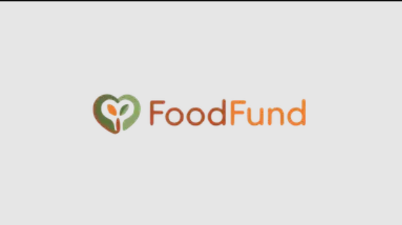
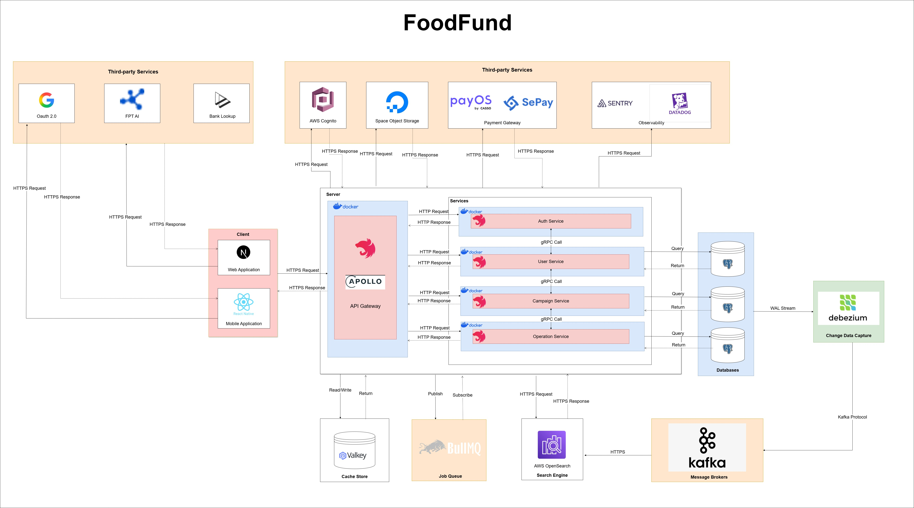

# FOODFUND - GRADUATION CAPSTONE PROJECT

> Completing this Capstone Project marks the significant conclusion of our four-year journey at FPT University. It has been a challenging yet rewarding semester, and we could not have reached the finish line without the guidance and support of our mentors and peers.
> 
> We are deeply grateful to the Board of Directors and the Software Engineering Department at FPT University for providing the resources and academic foundation necessary for this thesis. The knowledge we have gained over the years was instrumental in bringing this project to life.
> 
> A special thanks goes to our supervisor, Mr. Nguyễn Minh Sang. His mentorship, from the initial ideation phase to the final product, was critical in shaping the quality of our work. We truly appreciate the time he spent reviewing and directing our team.
> 
> We also want to thank Mr. Đỗ Tấn Nhàn, Mr. Tôn Thất Hoàng Minh, Mr. Nguyễn Thế Hoàng, Mr. Đặng Ngọc Minh Đức, and all the lecturers who took the time to provide constructive feedback. Your insights on our shortcomings helped us refine the project and deliver a more complete solution.
> 
> To my team members: thank you for the hard work, patience, and collaboration. We stuck together from the beginning, and that persistence was the key to our success.
> 
> We also extend our thanks to our families and friends. Your encouragement and outside perspectives gave us the motivation and fresh ideas we needed during this final stage.
> 
> Finally, while we have put our best effort into this project, there may still be room for improvement regarding technology and business logic. We welcome any feedback and appreciate your continued support as we start our careers.
> 
> Sincerely,</br>
> FoodFund Team
<p align="center">
  <a href="https://food-fund.vercel.app/" target="blank"></a>
</p>

## Table of Contents
- [Project Introduction](#project-introduction)
- [Technology Stack](#technology-stack)
- [System Architecture](#system-architecture)
- [Installation Guides](#installation-guides)
- [License](#license)

## Project Introduction
### Overview
&nbsp; &nbsp; &nbsp; FoodFund is a web and mobile-based crowdfunding and operations management platform designed specifically for charitable food preparation and distribution campaigns. The system centralizes donation collection, transparent fund disbursement, ingredient management, kitchen workflows, and delivery tracking into a single integrated solution.

&nbsp; &nbsp; &nbsp; Currently, food charity initiatives in Vietnam are often managed manually or via fragmented social media groups, leading to inefficiencies, lack of transparency, and low donor trust. FoodFund addresses these challenges by digitizing and standardizing the entire workflow of a fundraising campaign—from receiving donations to preparing and delivering meals.

### Major Features
#### Donors 
- Browse available campaigns in the system
- Track campaign progress (target amount, received amount, donation count, status...)
- Donate to campaigns
- View donation history and transaction details
- View organization wallet transactions
- View campaign disbursement requests
- View campaign expense proofs
- View meal batch cooked in campaigns
- View delivery task status in campaigns
- View & interact with campaign posts 
- Earn badge based on contribution
- Receive notifications on campaign update
- Send request create organization to the system
- Send request join organization to fundraiser

#### Fundraisers 
- Manage organization members (kitchen staff, delivery staff)
- Send requests to create fundraising campaigns to the system 
- Extend campaign fundraising end date
- Submit disbursement requests per phase (ingredient purchase/cooking/delivery)
- Track records of disbursement requests
- Assign tasks to delivery staffs
- View campaign progress dashboard
- Track organization wallet usage history
- Approve/Reject the transfer of cancelled campaign
- Publish campaign posts

#### Kitchen staff 
- View list of planned ingredients and meal batches of campaign
- Upload expense proofs (purchased ingredients image/video, bill image) after purchasing ingredients
- Track records of expense proof status
- Upload meal batch media and update cooked meal batch status
- Track meal batch progress

#### Delivery staff 
- View available assigned distribution meal batches and assigned areas/schedules
- Accept/Decline assigned ready meal batches
- View and update delivery task status

#### Administrators 
- View system dashboard
- Manage user accounts
- Manage organization creation requests
- Manage campaigns 
- Manage campaign categories
- Manage badges
- Transfer cancelled campaign to active organizations 
- Manage organization disbursement requests
- Manage campaign expense proofs
- Track each organization wallet transactions
- Config system

## Technology Stack
- **Backend Framework**: NestJS
- **Database**: PostgreSQL
- **ORM**: Prisma
- **API Styles**: GraphQL Federation, REST & gRPC
- **Authentication**: AWS Cognito
- **Caching**: Valkey
- **Containerization**: Docker
- **Container Orchestration**: Kubernetes
- **Message Brokers**: Kafka, BullMQ
- **Seach Engine**: Open Search
- **Change Data Capture**: Debezium
- **Cloud Storage**: S3 Storage
- **Payment Processing**: PayOS, SePay
- **Observability**: Datadog, Sentry
- **Logger**: Winston
- **Code Quality**: SonarQube, ESLint, Prettier

## System Architecture


## Installation Guides
### System Requirements
Before setting up the project, ensure your environment meets the following requirements:
```bash
- Node.js: v24.x.x or higher
- Docker & Docker Compose: Latest stable version
- PostgreSQL: 18.x or higher
- Redis Insight: 2.70.x or higher
- NPM: Package Manager
```

### Installation Instruction
#### Step 1. **Clone Repository**
```bash
git clone https://github.com/huynhdinhluyen/foodfund-server.git
cd foodfund-server
```

#### Step 2. **Install Dependencies**
```bash
npm install
```

#### Step 3. **Environment Configuration**
Copy the example environment file:
```bash
cp .env.example .env
# Edit .env with your credentials:
# - Database URLs
# - AWS credentials (Cognito, SQS)
# - Payment gateway keys
# - Datadog/Sentry tokens
```

#### Step 4. **Infrastructure Setup**
```bash
docker-compose up -d
```

#### Step 5. **Database Migration & Seeding**
```bash
# For User Service
npx prisma migrate dev --schema=apps/user/prisma/schema.prisma

# For Campaign Service
npx prisma migrate dev --schema=apps/campaign/prisma/schema.prisma

# For Operation Service
npx prisma migrate dev --schema=apps/operation/prisma/schema.prisma
```

#### Step 6. **Running the FoodFund Server**
```bash
# Start a specific service
npm run start:auth
npm run start:user
npm run start:campaign
npm run start:operation

# Start the GraphQL Gateway
npm run start:gateway
```

## License
This project is licensed under the [MIT License](https://github.com/nestjs/nest/blob/master/LICENSE).